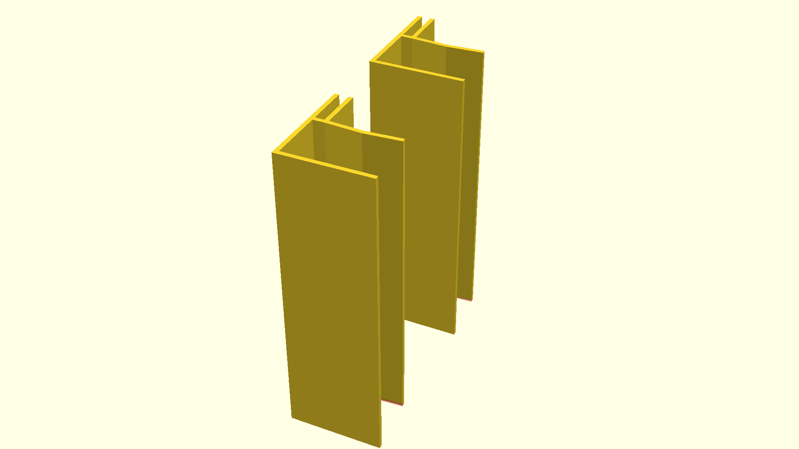

# A holder setup for acrylic sheets

This is so that one can block off a shelf with acrylic sheets. The aim is to
stop cats from making use of said shelf.

Obviously, a shelf that's windowed off ceases to function as a shelf. In a
sense. You can still look at it. Up to you.

