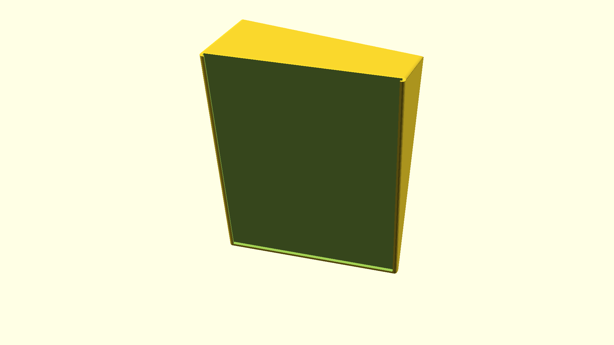

# A mirror holder

This project holds an IKEA LÖNSÅS mirror in a wall mount at a parameterised
rotation around X (up/down) and Z (left/right). 

The point of this is to be able to mount this on a wall opposite of where a
permanent mirror is installed to allow the user to look at themselves from
behind. Which has uses in a bathroom.

The major part of the design is a mirror holder (larger than the mirorr) with a
cutout for the mirror to slide into. This part is then lifted and rotated
`mirror_rot_xz = [10,10]` into place so that it clears the wall (with another
`wall_w` to spare so it doesn't touch the wall). After that, it is used to cast
its own shadow (an OpenSCAD `projection()`) onto the wall. Finally, negative
cutouts for 3M hooks are subtracted.

- The design considers the XZ plane to be the "wall."
- A LÖNSÅS mirror is 21cm × 30cm and 4 mm deep (held in `mirror_cutout_wdh =
  [210+1.0,300+1.0,4+0.5];`).
- The wall mount uses two top/one bottom 3M attachments, `libs/3m_hooks.scad`
  laid out in a triangular layout.
- The design prints solid. It is not adjustable once printed.

