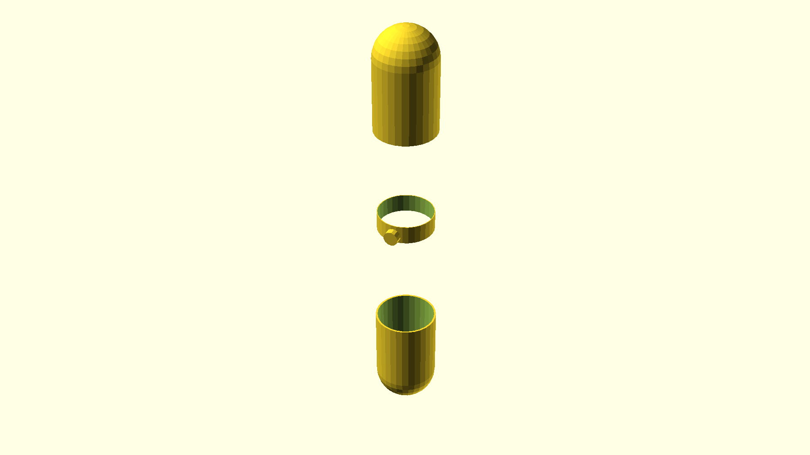

# A system for holding a cat net in a balcony

This takes an approach where two columns of heavy-duty curtain rods (could be
any kind of sturdy cylinder, however) hold the net between them.

This is probably best printed in TPU. The feet are flexible and the sturdiness
of them depends on how much they can be pre-tensioned. The clasps need to be
printed with slight undersizing in their radiuses so they can hold firmly in
place.

