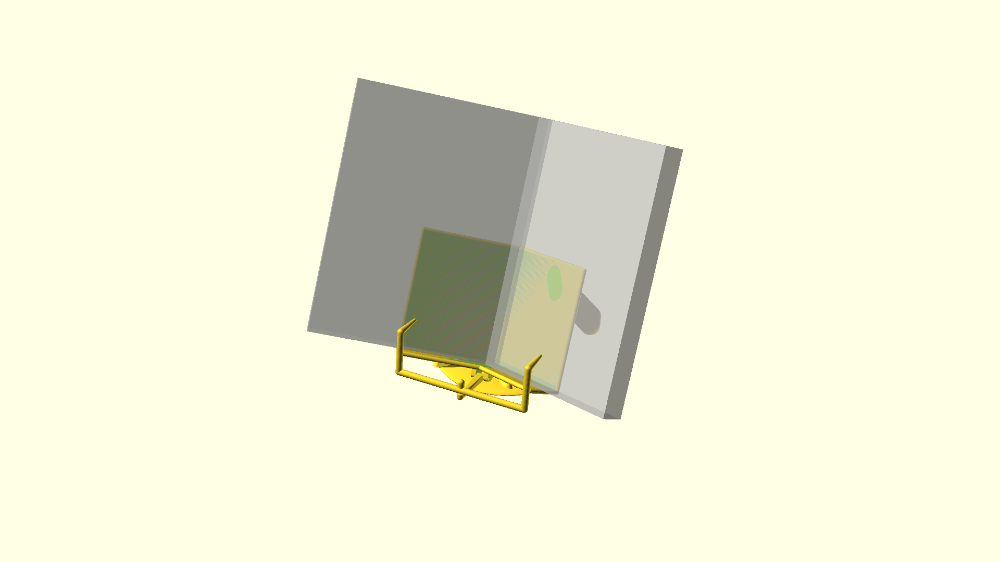

# A book holder

This works pretty well for hardbacks, but makes a positive contribution to paperbacks, too.

It's meant to be used both on a tabletop or while lying down. The handles provide a reasonable amount of control.
