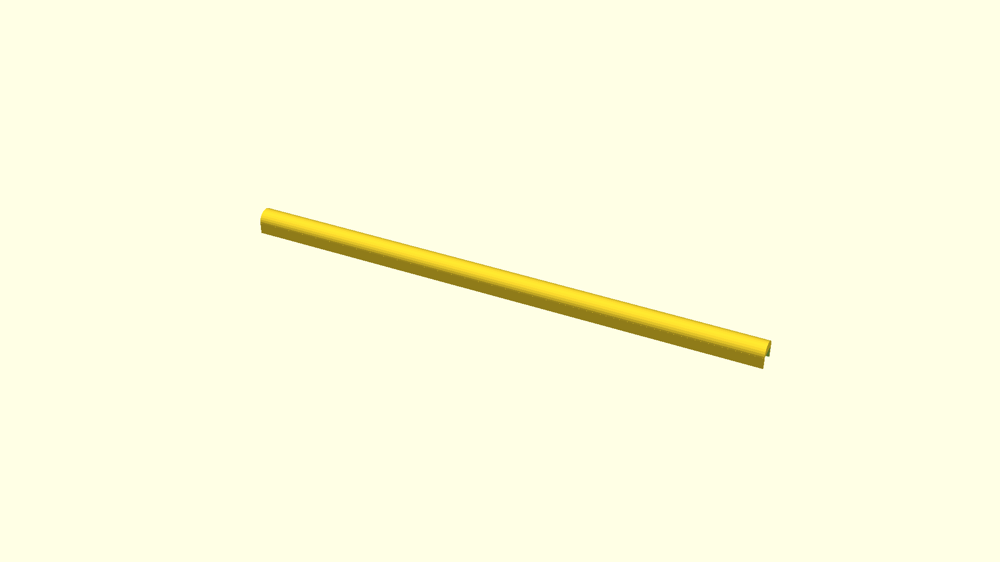

# Shoe cabinet safety piece

This is a rounded piece to attach to the doors of an IKEA Bissa shoe cabinet.

This is to prevent cat claws from being able to attach themselves to it. So as
to avoid climbing.

