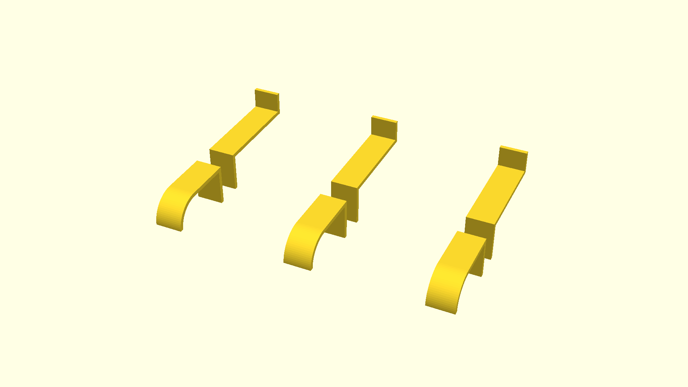

# Holders for a CNC curtain

I.e. for those zigzaggy curtains that'll protect your threaded rods.

One side is for mounting the accordion part of the setup; the other goes whereever there's a risk the accordion might sink into the path of somewhere and should be kept away.

