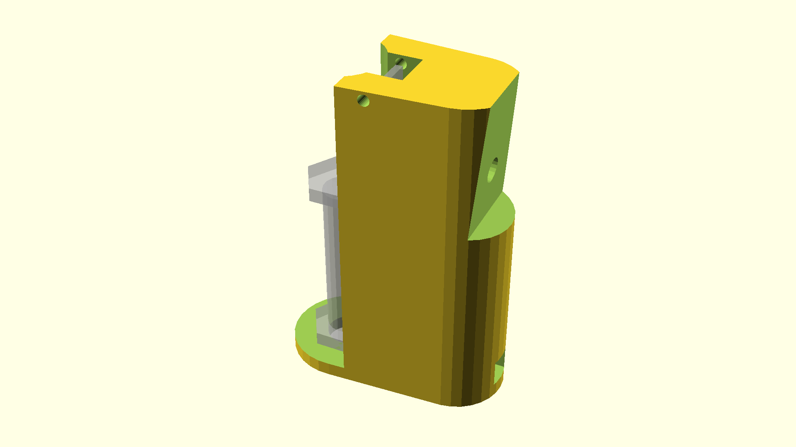

# A CNC probe tool

This is made to work with bCNC's `M6` tool change support.

The idea is that an electrical connection is made between a flat-headed bolt (which is permanently mounted to the build plate) and the tool bit. To facilite this, the other probe wire needs to touch the tool as it descends.

This puts a pivoting piece of metal into the downward path of the tool.

