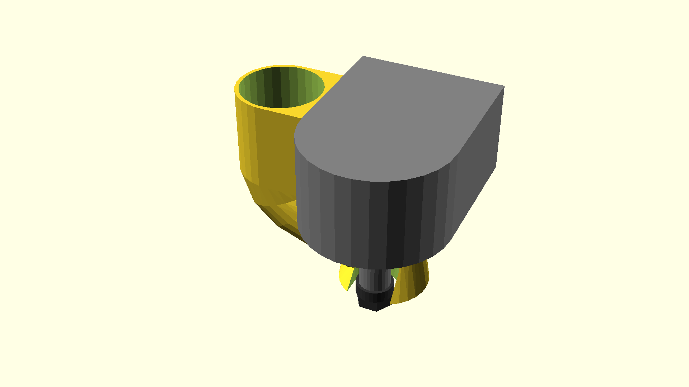

# A CNC machine vacuum adapter

I got annoyed with the choice between a CNC dust shoe and no extraction.
- A classic brushed CNC dust shoe is a difficulty with mountings and Z travel.
  It also hinders visibility quite a bit.
- However, the alternative of no extraction isn't great either. It's a bit of a
  sawdust mess on e.g. leadscrews and also hinders visibility.
- Running a vacuum like this adds a bit of cooling to the part and bit too.

This design fits the Sainsmart Genmitsu 3020PRO (whose Z axis assembly is
modeled) and aims to provide suction reasonably close to the action—without
needing bristles and still allowing easy access to the ER11 nut and the
counter-hold on the spindle axis.

## Using this

This'll probably need to get printed with supports. Tree supports can extend
into the funnel if desired. That could cause a smoother airflow.

Alternatively consider printing with a low (variable?) layer height for the
funnel parts. This would also potentially cause less turbulence and an easier
time navigating the overhangs.

Assuming the model fits your Z axis assembly, there's not much assembly
required. Use double adhesive tape to mount to a flat side of the gantry and
potentially use a cable tie for tensioning around the gantry.

## Customising this

- You'll generally first want to modify `hose_r` to fit your vacuum hose.
- The `rings()` function is the primary way of controlling the funnel. I
  suggest measuring your particular Z axis assembly and updating the model to
  correctly fit this an then tweaking `rings()` afterwards.
- If you have a larger last ring

## Design philosophy

This aims to, uhm, "aim" the airflow at the cutting point but at the height of
the ER11 nut. This should mean it won't collide with mounts etc and should give
a reasonable level of extraction.

Alternative aims of a design:
- Insofar this will be situated right above the ER11 collet: make use of one of
  those CNC fans (e.g.
  [thing:2853095](https://www.thingiverse.com/thing:2853095)) but make it suck
  upwards instead of push downward; this hopefully will assist in picking up
  dust into the relative vacuum (which at this point doesn't need to be quite
  as strong) of the suction system).
  - It's probably worth making the fan (quite a bit?) smaller in diameter than
    the ring it'll be sucking into so as not to blow things past the vacuum.
  - Doing this would probably require redesigning those fans a bit. E.g. by
    reaching over the top of the ER11 nut's round part.

