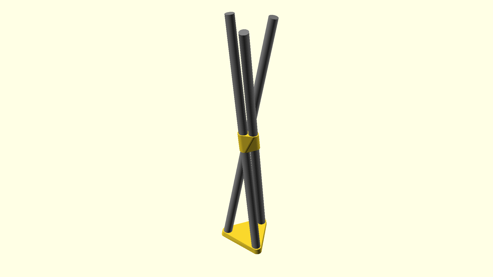

# A plant riser based on curtain rods

Note that (while it's probably flexible) you'll want to look out for the `echo()` of the derived `rod_length`:

```
ECHO: "rod_length:", 904.266
```

This is the length you'd cut the rod to. Give or take.


