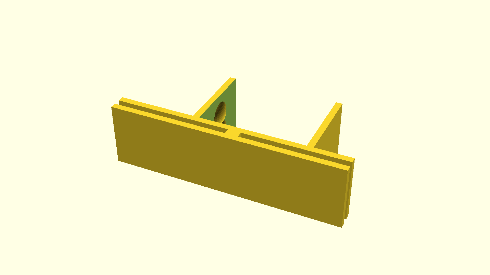

# A clamp to hold tight rolling curtains

The purpose of this thing is to make a room a bit darker than would otherwise be possible with loosely-fitting blackout curtains. It's used together with a projector in its current version.
