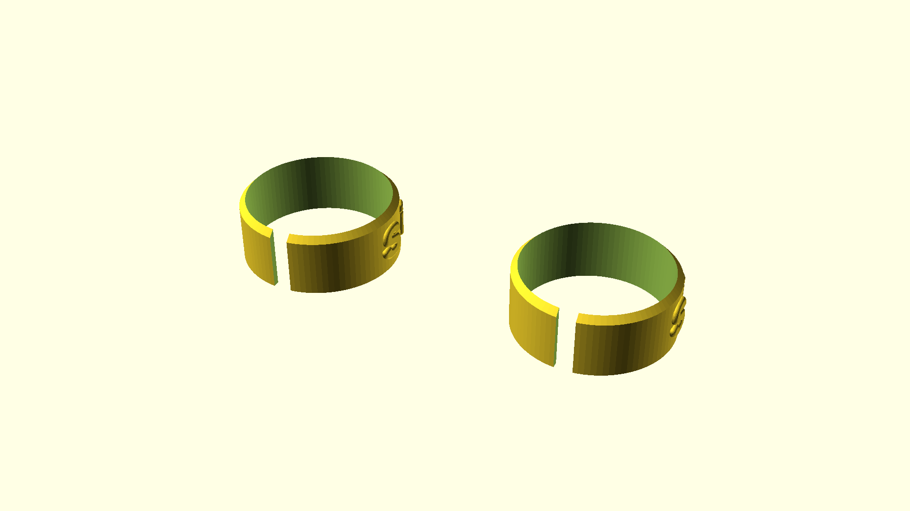

# A cylindrical label

This is to inconspicuously label containers upon which a cylindrical label would fit

These take a fair while to render but don't have high memory requirements.

Text rendering inspired from [this article](https://www.openscad.info/index.php/2020/07/02/cylindrical-text-the-easy-way/). [This library](https://github.com/brodykenrick/text_on_OpenSCAD) might be a better fit. Oh well.

