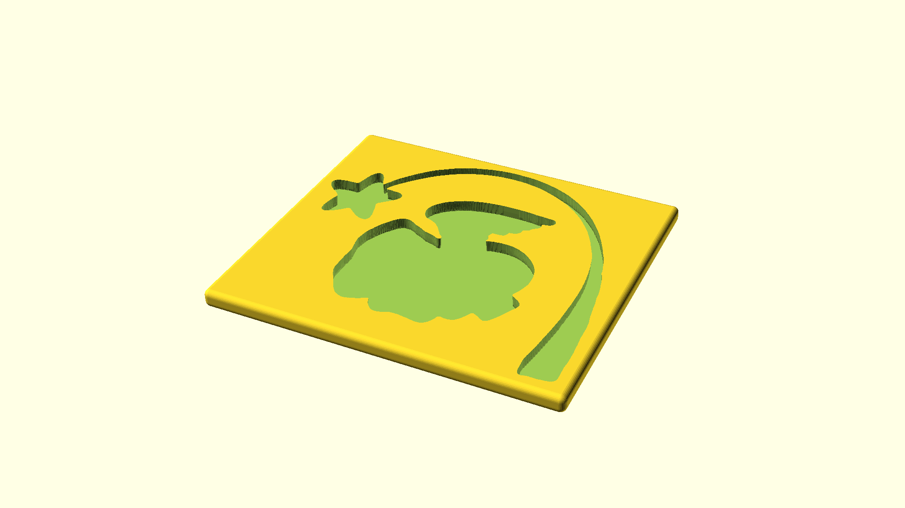

# A case that fits a `.png` image

This is to enable secure storage of flat-packed objects. Designed for storing a
flat seasonal decoration securely between years.

I never made this work. The concept is sound, I think, but the devil is in the
details.

This case assumes that you've pre-processed the image similarly to
`cutout.png`:

* Added enough padding around the shape itself.
   * You have the basic image in black and white, in image editing programmes,
     you can use blurring and contrast/brightness before indexing back to two
     colours again.
* Converted to black-and-white.
* Cropped the image to the outer edge of the `cutout_bounding_box` you've
  configured. As a tip, you should do this last, after adding padding etc.

Depending on image resolution, this tends to make OpenSCAD fairly memory hungry.
