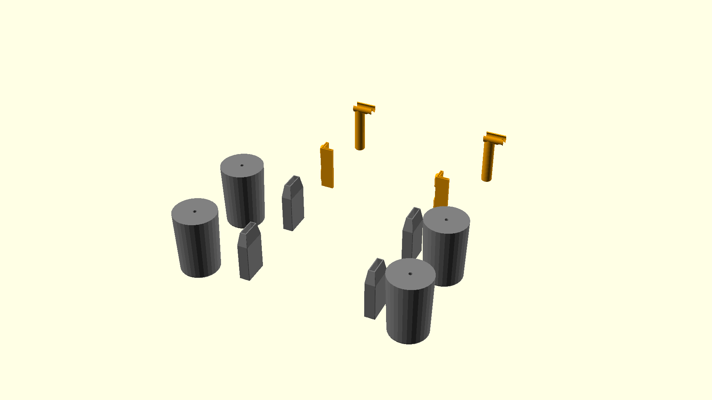

# A set of replacement feet for a IKEA Vimle sofa bed

These lift the whole "2-seat sofa bed section" and the wide armrests further
off the floor.

The motivation here is to allow a robotic vacuum cleaner to clean under the
sofa bed.

This obviously will lift the seat height further above floor height. Which
might be uncomfortable for some. Each to their own.

## Components

This consists of several components:
- The `round_foot()`. This attaches to the side cushions of the sofa and
  attaches with a bolt (a long tool will be required to tighten).
- The `rectangular_foot()`. This attaches to the metal frame that carries the
  weight of the mattress and the seating area.
- The `l_shaped_foot()`. This attaches to the legs that rotate out when opening
  the sofa bed. These will likely be too long to work with the mechanism. No
  good solution as of this writing.
- The `beam_foot()`. This attaches to the furthest leg frame beam (the one that
  by design does not reach the floor when not weighed down). This needs
  rotating into place.

## Printing strategy

There isn't much to it. You'll likely want high-ish top layer count (I went
with 5) and some amount of infill. These components are exposed almost
exclusively to compressive loads into the layer lines, which 3D prints are
pretty good at handling.

The `l_shaped_foot()` has internal magnets (measuring
`l_shaped_foot_magnet_cutout_rh`). These should be popped into the print during
printing. You should use your slicer's ability to insert pauses at specified
G-code heights (or manually pause the print). The slots are designed to be tall
enough that the whole magnet fits in at the time a pause should be scheduled.

The `round_foot()` and the `rectangular_foot()` should be printed in
material-appropriate colours. The `l_shaped_foot()` and `beam_foot()` should be
printed in highly visible colours as they need to be noticed during operation.

