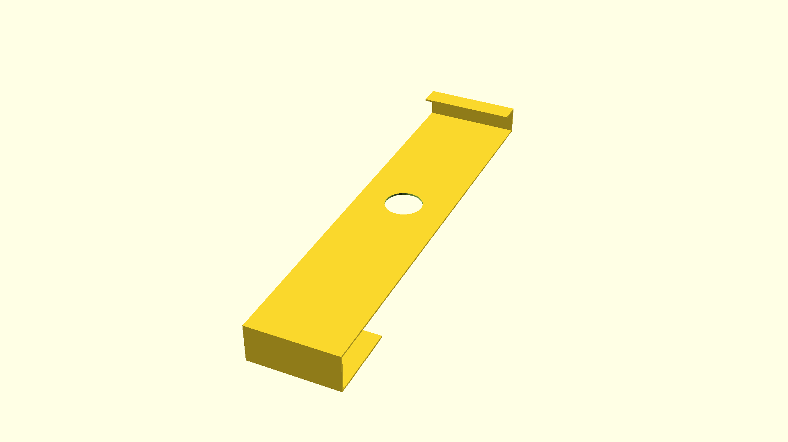

# A distance piece for a keyboard

Supposedly, the idea is that one places a keyboard so close to the edge of a
standing desk that only the wrists rest on the table. This is a small piece
that would hold the keyboard at an appropriate distance for that.

