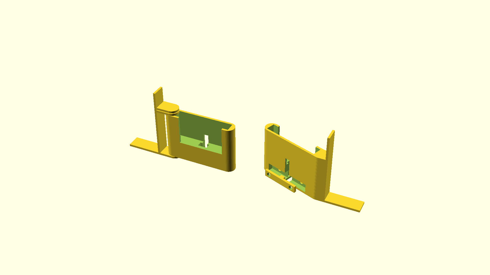

# A phone holder for mounting on a computer screen

This offers two styles of phone mount. One that rotates in place and one that's fixed. Prefer the fixed version if possible.

The `cable_clasp` module is meant to use M6 bolts. If you have different bolts available, you could try modifying the `.scad` accordingly.

I did not produce a version for the left side of the screen. It should be possible to mirror in slicer software.

Thanks to [threadlib](https://github.com/adrianschlatter/threadlib) for providing convenient M6 `tap()`.
