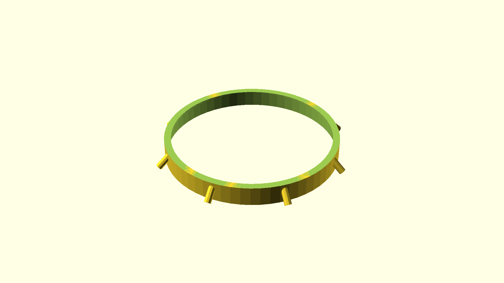

# A device to center something in a pot

This was produced to keep spring onion mostly facing upwards, while standing in
a cylindrical glass vase.

If this is going to be used in an environment where sunshine is present, it
might be worthwhile using temperature-resistant filaments like PETG or TPU.

