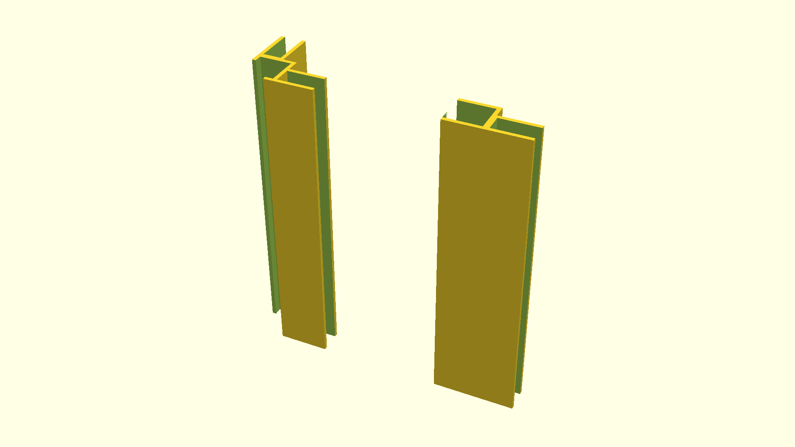

# A pane holder for a shelf

This holds panes of acryllic in place between vertical segments. Designed to
make a cat bed out of such a shelf, however, it probably can be used for many
other things.

