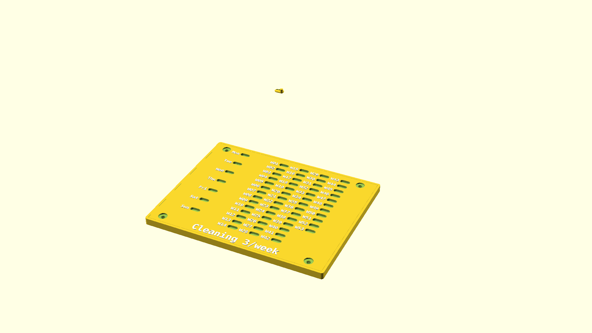

# A parametric board of sliders

This is meant as a habit-keeping apparatus. The idea is that you can create a
board of sliders and the gratification of sliding one over becomes motivation
to keep to the habit.

## Design goals

- Satisfying slider action
- Reliable sliders
- Cheap-ish to print
- Ideally, able to print in a fashion that holds a whole year on most printers

